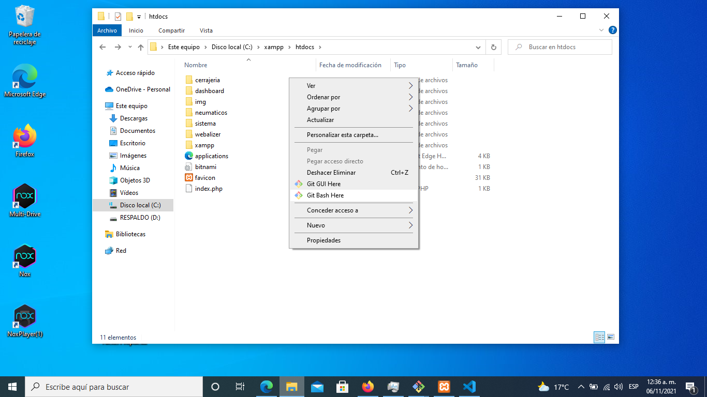

# Videos que les recomeindo que vean para entender PHP.
* [Git primeros pasos.](https://www.youtube.com/watch?v=VwhdFwrzrXo)
* [Curso de Laravel :v jajajaja](https://www.youtube.com/watch?v=A-BL8Ir7puE&list=PLZ2ovOgdI-kWWS9aq8mfUDkJRfYib-SvF)


# Cargar las migraciones (Bases de datos)

Para  crear las tablas que necesita la base de datos, deben de revisar el archivo _.env_
tengo las cosas que necesita.
```
    DB_CONNECTION=mysql
    DB_HOST=127.0.0.1
    DB_PORT=3306
    DB_DATABASE=laravelcerrajeria
    DB_USERNAME=root
    DB_PASSWORD=narvaez
```
lo que les importa es "DB_DATABASE" donde tiene que poner el nombre de la base de datos,
tiene que estar vacia (la deben de crear desde el DBMS), en "DB_PASSWORD" ponen la contraseña si es que tiene.
___
Cuando ya tengan la tabla y las configuraciones, ejecuta el comando,
```
    php artisan migrate
```
Si ya tenian las tablas ejecuten 
```
    php artisan migrate:fresh
```
Al final de cualquiera de los dos deben de introduccir el comando.
```
    php artisan db:seed
```
es posible que les marque un error, pero deben de checar en la tabla de 
"usuarios", que es en donde se hicieron las inserciones.


# Descargar el repo 
Si aun no han descargado el repo, o lo van a descargar de nuevo, deben de entrar a la 
carpeta de htdocs

```
    C:\xampp\htdocs\
```


Una vez en esa carpeta abren la terminal de git y ejecuatn los comandos.
```
git clone https://gitlab.com/NarvaezRuizAlexis/cerrajeria.git
git cd cerrajeria
    ---> Esto lo deben hacer para vincular las ramas remotas con las locales.

git checkout Omar 
git checkout Jenni
git checkout Dafne
git checkout Roberto
git checkout Narvaez

    --> Al final deben estar parados en la rama que les corresponde
    --> En mi caso es "Narvaez"

git checkout Narvaez 
composer install
php artisan serve
```

Cuando ejecuten el ultimo comando, deben de pegar esa URL en el navegador y ya.


___
<p align="center"><a href="https://laravel.com" target="_blank"></a></p>

<p align="center">
<a href="https://travis-ci.org/laravel/framework"></a>
<a href="https://packagist.org/packages/laravel/framework"></a>
<a href="https://packagist.org/packages/laravel/framework"></a>
<a href="https://packagist.org/packages/laravel/framework"></a>
</p>

## About Laravel

Laravel is a web application framework with expressive, elegant syntax. We believe development must be an enjoyable and creative experience to be truly fulfilling. Laravel takes the pain out of development by easing common tasks used in many web projects, such as:

- [Simple, fast routing engine](https://laravel.com/docs/routing).
- [Powerful dependency injection container](https://laravel.com/docs/container).
- Multiple back-ends for [session](https://laravel.com/docs/session) and [cache](https://laravel.com/docs/cache) storage.
- Expressive, intuitive [database ORM](https://laravel.com/docs/eloquent).
- Database agnostic [schema migrations](https://laravel.com/docs/migrations).
- [Robust background job processing](https://laravel.com/docs/queues).
- [Real-time event broadcasting](https://laravel.com/docs/broadcasting).

Laravel is accessible, powerful, and provides tools required for large, robust applications.

## Learning Laravel

Laravel has the most extensive and thorough [documentation](https://laravel.com/docs) and video tutorial library of all modern web application frameworks, making it a breeze to get started with the framework.

If you don't feel like reading, [Laracasts](https://laracasts.com) can help. Laracasts contains over 1500 video tutorials on a range of topics including Laravel, modern PHP, unit testing, and JavaScript. Boost your skills by digging into our comprehensive video library.

## Laravel Sponsors

We would like to extend our thanks to the following sponsors for funding Laravel development. If you are interested in becoming a sponsor, please visit the Laravel [Patreon page](https://patreon.com/taylorotwell).

### Premium Partners

- **[Vehikl](https://vehikl.com/)**
- **[Tighten Co.](https://tighten.co)**
- **[Kirschbaum Development Group](https://kirschbaumdevelopment.com)**
- **[64 Robots](https://64robots.com)**
- **[Cubet Techno Labs](https://cubettech.com)**
- **[Cyber-Duck](https://cyber-duck.co.uk)**
- **[Many](https://www.many.co.uk)**
- **[Webdock, Fast VPS Hosting](https://www.webdock.io/en)**
- **[DevSquad](https://devsquad.com)**
- **[Curotec](https://www.curotec.com/services/technologies/laravel/)**
- **[OP.GG](https://op.gg)**
- **[CMS Max](https://www.cmsmax.com/)**
- **[WebReinvent](https://webreinvent.com/?utm_source=laravel&utm_medium=github&utm_campaign=patreon-sponsors)**
- **[Lendio](https://lendio.com)**

## Contributing

Thank you for considering contributing to the Laravel framework! The contribution guide can be found in the [Laravel documentation](https://laravel.com/docs/contributions).

## Code of Conduct

In order to ensure that the Laravel community is welcoming to all, please review and abide by the [Code of Conduct](https://laravel.com/docs/contributions#code-of-conduct).

## Security Vulnerabilities

If you discover a security vulnerability within Laravel, please send an e-mail to Taylor Otwell via [taylor@laravel.com](mailto:taylor@laravel.com). All security vulnerabilities will be promptly addressed.

## License

The Laravel framework is open-sourced software licensed under the [MIT license](https://opensource.org/licenses/MIT).
